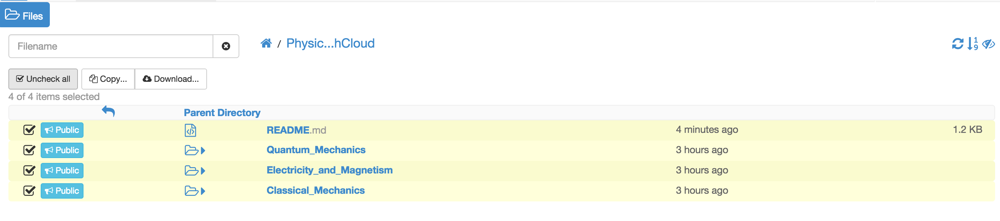
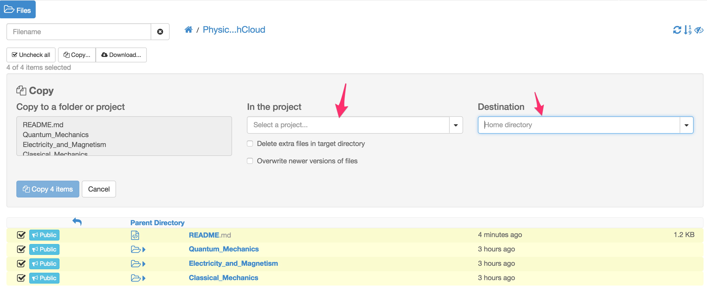

# Physics with SageMathCloud
---

These files are a series of tutorials for using SageMathCloud to teach physics.  It contains a collection of SageMath worksheets that you can use to teach yourself how to use SageMathCloud or that can be used as assignments or tutorials for your physics students.

- [Quantum Mechanics in SageMathCloud](Quantum_Mechanics/Using SageMathCloud to Teach Quantum Mechanics.md)

### Future Topics
 - Classical Mechanics
 - Electricity and Magnetism

# To Use These Templates in SageMathCloud
---

 If you have an internet access upgrade on your project you can clone them into your working directory via

1. Inside your SageMathCloud project, click on `Browse Menu`, then move to the top-level directory where you want these files located.
1. Click the [+ Create] button,
1. Enter `https://github.com/zimmermant/physics_with_smc.git` in the text box,
1. Then click on `Download from Internet` to download and clone the entire project.

If you **do not** have an internet access upgrade on your project you can

1. Go to [Physics with SageMathCloud](https://cloud.sagemath.com/projects/d18eeda9-38fb-4d20-9a0a-4afa03a182aa/files/Physics_with_SageMathCloud/) 

2. Select all of the files you wish to copy to your project.

3. Select the project and directory you wish to copy the files to and...
4. ...click on `Copy N items` to create copies of these files that you can edit inside your project.

